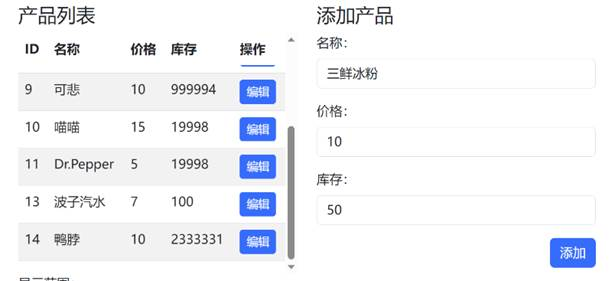

# Java-Pos-Web
a pos (point of sale) web demo using java backend.
---
用作我的课程项目（同时满足这三门课）：
- 软件开发环境与工具
- 软件工程导论
- 数据库系统和信息管理
---
实践了许多软件工程中的设计模式和思想，遵循瀑布开发流程；通过MySQL数据实现数据管理；前端质朴，纯html+css+js，后端采用spark（Java）。
详细信息整理在课程报告中，希望对你有所帮助。

（数据库那份里的数据库设计写得全是问题，自己当时赶时间根本没仔细核查范式，谁叫我为了应对另外俩课的考察，早早建库开整，没注意这些事项qwq）

---

注意不能直接运行，要配合前端文件夹目录。

详细信息请看release文件夹。

---

 

|      |                                         |
| ---- | --------------------------------------- |
|      |  |

一次完整销售过程示例：

查看数据库记录：

TransactionLog：

Payments：

Orders：

OrderDetails：

Products：（库存发生相应变化）

 

 

库存管理页stock.html

 

|      |                                         |
| ---- | --------------------------------------- |
|      |  |

查询用例：

编辑用例：

 

 

添加用例

 

删除用例

 
